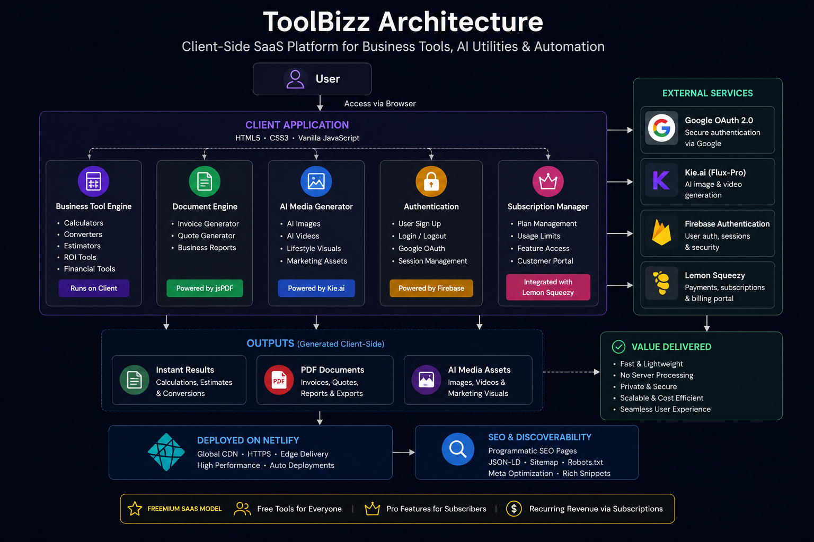
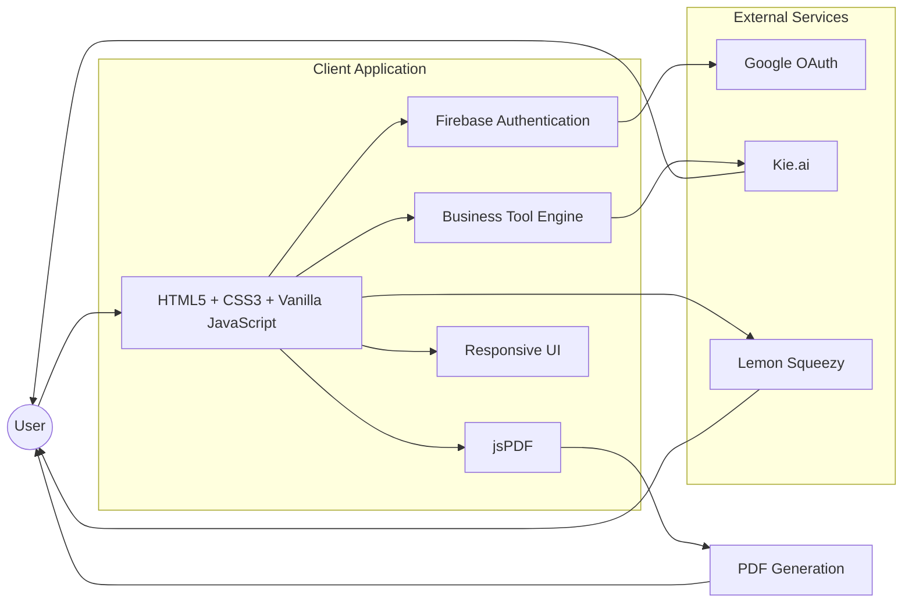
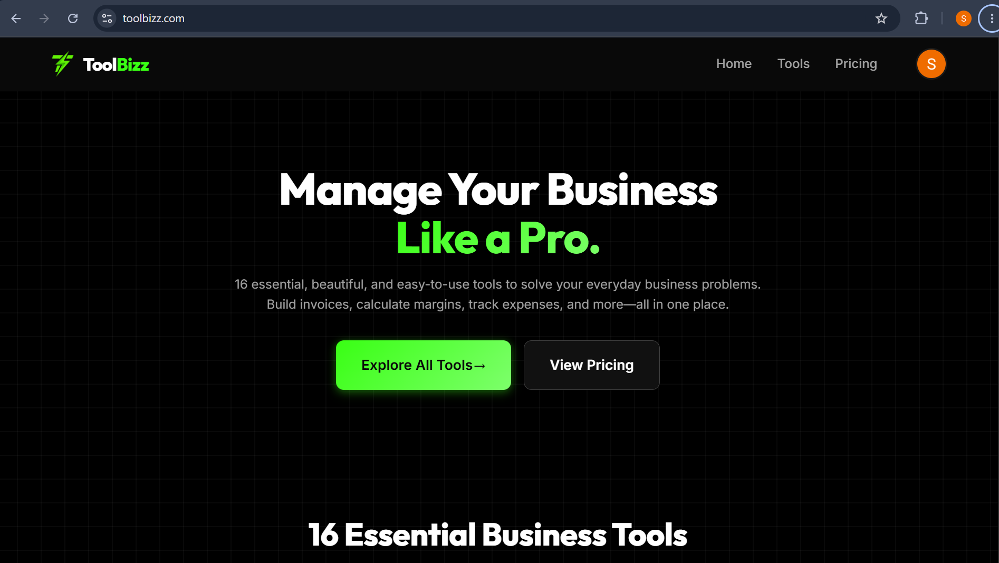

# ToolBizz

### AI-Powered Business Toolkit for Freelancers & Small Businesses


---

## Executive Summary

ToolBizz is a modern SaaS platform built to simplify everyday business operations for freelancers, independent professionals, agencies, and small businesses.

Instead of relying on multiple disconnected applications, ToolBizz consolidates business calculators, invoice generation, AI-powered utilities, and productivity tools into a single fast, lightweight web application.

The platform follows a freemium business model where users can immediately access valuable tools while premium subscribers unlock advanced AI capabilities and unrestricted usage.

Beyond the product itself, ToolBizz was engineered around scalability, performance, and discoverability. A programmatic SEO architecture enables dozens of niche landing pages to attract highly targeted organic traffic, while a client-side architecture keeps the platform extremely responsive without requiring a traditional backend.

---

## Live Demo

**Website**

> https://your-demo-link.com

---

## Table of Contents

- [Executive Summary](#executive-summary)
- [Live Demo](#live-demo)
- [Key Features](#key-features)
- [Tech Stack](#tech-stack)
- [System Architecture](#system-architecture)
- [Screenshots](#screenshots)
- [Project Structure](#project-structure)
- [Engineering Challenges](#engineering-challenges)
- [Performance Optimizations](#performance-optimizations)
- [SEO Strategy](#seo-strategy)
- [Business Model](#business-model)
- [Lessons Learned](#lessons-learned)
- [Future Improvements](#future-improvements)
- [Source Code](#source-code)
- [About the Developer](#about-the-developer)
- [Contact](#contact)

---

# Key Features

## Business Productivity Suite

A growing collection of practical tools designed specifically for freelancers and service businesses including invoice generation, pricing calculators, ROI analysis, salary conversion, employee cost estimation, and financial planning utilities.

---

## AI Media Generation

Integrated AI-powered image and video generation allows users to instantly create professional lifestyle visuals and marketing assets directly inside the platform.

Powered by Kie.ai Flux-Pro models.

---

## Instant PDF Generation

Professional invoices and business documents are generated entirely inside the browser using jsPDF.

No user documents are uploaded to a server, providing excellent privacy while reducing infrastructure costs.

---

## Programmatic SEO

One of the platform's biggest engineering goals was long-term organic growth.

Rather than manually creating pages, ToolBizz uses a scalable SEO strategy with niche-specific landing pages targeting highly relevant search intent.

Examples include:

- Invoice Generator for Freelancers
- Profit Calculator for Plumbers
- Pricing Calculator for Electricians
- Break-even Calculator for Bakeries

Each page is optimized using structured data (JSON-LD), semantic HTML, metadata optimization, and Google Rich Snippets.

---

## Authentication

Google Authentication is implemented using Firebase Authentication, providing secure sign-in while minimizing friction for users.

---

## Freemium Subscription System

ToolBizz supports multiple user tiers.

- Guest Users
- Free Users
- Pro Subscribers

Premium users unlock unrestricted access, advanced AI tools, watermark-free exports, and additional business utilities.

---

## Responsive User Experience

The interface is fully responsive across desktop, tablet, and mobile devices while maintaining consistent performance and usability.

---

## Privacy First

Since most tools execute entirely inside the browser, user-generated documents remain on the user's device whenever possible.

This minimizes server dependency while improving trust and application responsiveness.

---


# Tech Stack

| Layer | Technology |
|--------|------------|
| Frontend | HTML5 |
| Styling | CSS3 |
| Programming Language | Vanilla JavaScript (ES6) |
| Authentication | Firebase Authentication |
| AI Integration | Kie.ai (Flux-Pro) |
| PDF Generation | jsPDF |
| Payments | Lemon Squeezy |
| Deployment | Netlify |
| Architecture | Client-Side Serverless |

---

# System Architecture



## System Architecture



# Screenshots

## Dashboard



The dashboard acts as the central hub for accessing calculators, AI-powered utilities, invoice generation, and premium business tools.

---

# Project Structure

```
ToolBizz
│
├── assets/
│   ├── dashboard.png
│   └── architecture.png
│
├── css/
│
├── js/
│
├── images/
│
├── tools/
│
├── blog/
│
├── index.html
│
├── privacy.html
│
├── terms.html
│
└── netlify.toml
```

The project follows a modular structure that separates business logic, user interface, assets, and utility components, making the codebase easier to maintain and extend as new tools are added.

---

# Engineering Challenges

Building ToolBizz was more than developing a collection of business utilities—it required balancing performance, scalability, user experience, and long-term maintainability while keeping the platform lightweight and serverless.

## Designing a Serverless Architecture

One of the primary engineering goals was minimizing infrastructure complexity. By executing the majority of business logic directly in the browser, the platform eliminates the need for a traditional backend for core functionality.

This approach offers several advantages:

- Reduced hosting costs
- Lower infrastructure maintenance
- Faster response times
- Improved privacy
- Simplified deployment

---

## Balancing Performance and Functionality

As the number of tools increased, maintaining a fast user experience became increasingly important.

Engineering decisions focused on:

- Keeping JavaScript lightweight
- Minimizing third-party dependencies
- Reusing modular components
- Reducing unnecessary DOM updates
- Optimizing asset loading

---

## Building for Scalability

Rather than creating isolated pages, ToolBizz was structured so new business tools can be added with minimal effort.

This modular approach enables future expansion while keeping the codebase organized and maintainable.

---

## Authentication Without Friction

Authentication was intentionally designed to be simple.

Firebase Authentication enables users to sign in using Google with minimal onboarding friction while maintaining secure access to premium functionality.

---

# Performance Optimizations

Performance was treated as a core product feature throughout development.

Key optimizations include:

- Lightweight Vanilla JavaScript
- Client-side business logic
- Browser-based PDF generation
- Minimal external dependencies
- Optimized asset delivery through Netlify
- Responsive layouts across desktop, tablet, and mobile devices
- Efficient DOM rendering
- Fast initial page load

These optimizations contribute to a responsive experience while keeping infrastructure requirements low.

---

# SEO Strategy

Search engine optimization is a foundational component of ToolBizz rather than an afterthought.

The platform follows a programmatic SEO approach where targeted landing pages address specific user intents and business niches.

Key strategies include:

- Industry-specific landing pages
- Semantic HTML structure
- Optimized metadata
- JSON-LD structured data
- Google Rich Snippet support
- Internal linking strategy
- Clear content hierarchy
- Mobile-friendly implementation

This architecture enables sustainable organic traffic growth without relying solely on paid advertising.

---

# Business Model

ToolBizz follows a freemium SaaS model.

## Free Tier

- Access to essential business tools
- Basic calculators
- Invoice generation
- Limited AI functionality

## Pro Tier

Premium users receive access to:

- Unlimited tool usage
- Advanced AI-powered utilities
- Premium exports
- Watermark-free documents
- Additional business resources

Payments are managed using Lemon Squeezy, providing a streamlined subscription experience while minimizing payment infrastructure complexity.

---

# Lessons Learned

Developing ToolBizz provided valuable experience across multiple areas of software engineering beyond frontend development.

Key takeaways include:

- Designing scalable SaaS products
- Structuring modular JavaScript applications
- Implementing secure authentication workflows
- Integrating third-party AI services
- Building client-side document generation
- Applying SEO principles to product development
- Designing subscription-based user experiences
- Prioritizing performance and maintainability

More importantly, the project reinforced the importance of building software that solves real business problems rather than focusing solely on technical implementation.

---

# Future Improvements

Planned enhancements include:

- Team workspaces
- Analytics dashboard
- Additional AI-powered business tools
- User personalization
- Internationalization
- Advanced reporting
- Expanded calculator library
- API integrations
- Dark mode
- Enhanced accessibility support

---

# Source Code

The production source code is intentionally not included in this repository.

ToolBizz is an actively developed commercial SaaS product. This repository serves as a technical case study that documents the platform's architecture, engineering decisions, technology stack, and product capabilities while protecting proprietary implementation details.

---

# About the Developer

I enjoy building modern SaaS products that combine clean user experiences with scalable engineering and practical business value.

My interests include:

- Full-Stack Development
- AI Integrations
- Product Engineering
- SaaS Architecture
- Performance Optimization
- Developer Experience

---

# Contact

**GitHub**

https://github.com/sumamakhalil

**LinkedIn**

(Add your LinkedIn profile)

**Email**

(Add your professional email)

---

## Repository Status

**Project Type:** Commercial SaaS

**Development Status:** Active

**Repository Purpose:** Technical Portfolio & Product Showcase

---

If you found this project interesting, feel free to connect or reach out. I'm always open to discussing software engineering, SaaS development, AI-powered products, and remote opportunities.
